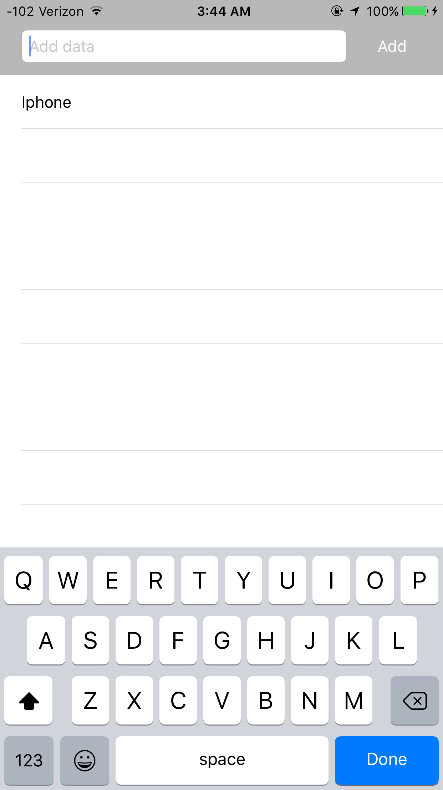

# Remote Notifications - iOS

## Intro
This project is intended to be a means of testing the capabilities of [Apple Push Notification Services](https://developer.apple.com/library/content/documentation/NetworkingInternet/Conceptual/RemoteNotificationsPG/APNSOverview.html#//apple_ref/doc/uid/TP40008194-CH8-SW1) and [Amazon Web Services](https://aws.amazon.com). To do this, I have written a client [iOS app](https://github.com/ChappyA12/RemoteNotifications_iOS) and a server [MacOS app](https://github.com/ChappyA12/RemoteNotifications_MacOS) that interface with both services to monitor various online triggers and send push notifications to numerous clients.

## iOS as a client
The iOS side of this project can set notification preferences that are then stored in an AWS server. The app will then recieve rich notifications whenever the server is triggered by one of these specified events. 

## Installation
#### AWS Servers
This backend app uses Amazon Web Services to store user data as well as temporary images for use in rich notifications. The DynamoDB pool and S3 bucket are authenticated using a [Cognito](https://aws.amazon.com/cognito/) unauth identity.

[Amazon DynamoDB](https://aws.amazon.com/dynamodb/) is used as a database solution that stores the keys ```pushToken``` (indexed), ```data``` in the form of a string array, and an ```update``` tag. The iOS app writes to this database whenever the user updates their notification preferences.

[Amazon S3](https://aws.amazon.com/s3/) is used as a temporary storage solution for images created at runtime and uploaded by the app. Public read permissions to the bucket must be [enabled](https://stackoverflow.com/questions/2547046/make-a-bucket-public-in-amazon-s3) to receive the image client-side.

#### NotifcationKeys.h
In order to get the iOS app to fully function correctly, the file 'NotificationKeys.h' must be created and put in the 'Notifications' project folder. The file should look something like this:
```obj-c
#ifndef NotificationKeys_h
#define NotificationKeys_h

#define AWS_POOL_NAME   @"pool-name"
#define AWS_POOL_ID     @"us-east-1:POOLID"

#define AWS_BUCKET_NAME @"bucket-name"

#endif
```

#### Cocoapods
[Cocoapods](https://cocoapods.org) is a dependency manager for Swift and ObjC projects. This app does not require additional setup to enable the pods to be used. the following pods are used:
* [AWS iOS SDK](https://github.com/aws/aws-sdk-ios) - database solution

## Images
#### Client-side database modification


#### Rich notification functionality


